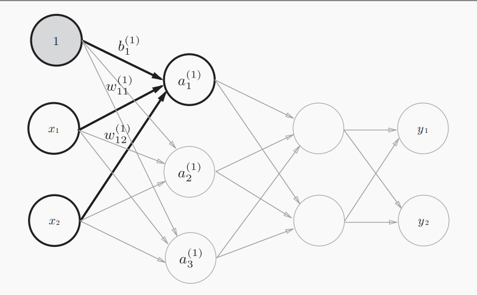

深度学习入门——基于python

## 感知机

> 什么是感知机？感知机的功能是什么？

感知机（perceptron）是1957年提出的，是一种具有输入和输出的算法。其又或称与“人工神经元”或“朴素感知机”。

它的功能是：给定一个输出后，将输出一个既定的值。

### 简单逻辑电路

> 与门、与非门和或门的权重表达(w1, w2, delta:阈值)。

- 与门（AND gate）：(0.5, 0.5, 0.7)

- 与非门（NAND gate）：(-0.5, -0.5, -0.6) ：与门的相反判断逻辑

- 或门（OR gate）：（0.5, 0.5, 0）


> 机器学习的任务是什么？机器学习的“学习”是学习什么？我们人在这个过程中需要做的是什么？

机器学习的任务是：将决定感知参数的任务交给机器完成，感知的参数就比如说上面的w1和delta等。

“学习”代表的是：让机器确定好合适的参数的这个过程。

人需要做的是：1、思考与构建模型；2、给予模型（计算机）参数。

### 感知机的实现

> 感知机将什么作为其设定参数？

感知机将**权重b**和**偏差w**设定为参数

> 与门如何实现？

```python
	def AND(x1, x2):
    # 权重和阈值设置（0.5，0.5，0.7）
    w1, w2, delta = 0.5, 0.5, 0.7
    tmp = w1*x1 + w2*x2
    if tmp > delta:
        return 1
    else:
        return 0

AND(1, 1) # 1
AND(1, 0) # 0
AND(0, 1) # 0
```

> 利用偏置b的方式表达与门函数 by numpy

```python
import numpy as np
# -- 与门的实现
def AND(x1, x2):
    x = np.array([x1, x2])
    w = np.array([0.5, 0.5])
    b = -0.7
    tmp = sum(w*x) + b
    if tmp > 0:
        return 1
    else:
        return 0
```

> **权重和偏置**的在调节模型上的区别？

权重（w）的调节在于：用来控制输入参数重要程度的参数

偏置（b）的调节在于：调节整个神经元被激活的难易程度的参数

### 感知机的局限

> 异或门是什么？能用感知机模型实现异或门吗？为什么？

**异或门**（XOR gate）：当两个输入一方为1的情况下，才会输出1。异或的意思是拒绝其他的意思。


无法使用（单层）感知机模型来实现异或门，可以用画图的形式来表达出异或门的区分域来或者用不等式来分析，在单一线性的感知机情况下，条件之间是矛盾的

> 感知机的局限在于哪？

我们来看看单层感知机是如何来划分不同情况的，与门的感知机可视化如图。


异或门单层感知机的可视化如图。很明显我们无法通过一个直线来划分⚪和▲，这就是单层感知机的局限。


感知机的局限就在这了，它只能表示一条直线分隔的空间，但是其可以被一条曲线来分隔，我们称这样被曲线分隔的空间为**非线性空间**。


### 多层感知机

> 如何利用已有逻辑电路来实现异或门？电路图是怎样的？

可以运用之前提到的**与门、与非门和或门**按照一定的规律链接来表示。电路图可以表示为：


> 异或门的实现

之前实现的函数现在被利用到了，是很神奇的事情~

```python
def XOR(x1, x2):
    s1 = NAND(x1, x2)
    s2 = OR(x1, x2)
    y = AND(s1, s2)
    return y
```

> 神经网络的引入，哪些是权重层呢？下图的感知机应该是几层感知机呢？


上面就是一个简单的多层结构的神经网络，我们可以把第0层和第1层之间的、第1层和第2层之间的视为权重层，按照权重来分的话，上图应该属于2层感知机。

### 从与非门到计算机

- 与非门的运行逻辑和计算机相同，都是输入后按照某种逻辑来进行计算来输出结果。

> 多少层的感知机就可以构建计算机或者说可以表达任意函数？

2层的感知机就可以了，严格来说应该是**激活函数使用了非线性的sigmoid函数的感知机**。当然使用2层感知机通过设定权重来构建计算机是一件非常非常麻烦的事情

- 感知机通过叠加可以进行**进行非线性表示**

## 神经网络

> 感知机的局限性在哪？神经网络的重要性质是什么？

感知机在选择合适的输入和权重的时候，还是需要人为的进行操作的。而神经网络是可以自动的从数据中来学习到合适的权重参数。

### 从感知机到神经网络

> 什么是激活函数？它的作用是什么？激活的过程是如何实现的呢？

这里引入一个**新的函数h(x)**，拿之前感知机函数举例，其控制函数是$y=b+w_1x_1~+w_2x_2$的形式，现在改为$y = h(b+w_1x_1+w_2x_2)$，它将输入信号的总和转为输出信号，**这个h(x)就是激活函数**(activation function)。

而**它的作用**是在于决定如何来激活信号的总合。其中在$y = h(b+w_1x_1+w_2x_2）$中的$b+w_1x_1+w_2x_2$可以合并为一个量，其为**输入加权输入信号和偏置的总和**视为节点a。


- “朴实感知机” - 单层网络；“多层感知机” - 神经网络

### 激活函数

#### 阶跃函数的实现

> 什么是“阶跃函数”，如何实现？能想象出它的函数图是怎么样的吗？

函数公式为$\begin{align*}
h(x) = 
\begin{cases}
1 & (x > 0) \\
0 & (x \leq 0)
\end{cases}
\end{align*}$

阶跃函数的实现如下：

```python
import numpy as np
import matplotlib.pyplot as plt

# - 简单呈现形式 但其无法输入np的数组形式
def step_function_origin(x):
    if x > 0:
        return 1
    else:
        return 0
    
# - 可对np数组函数进行处理
def step_function(x):
    y = x > 0
    return y.astype(np.int32) # 元素类型转化
# 解释
x = np.array([-1.0, 1.0, 2.0])
y = x > 0 # array([False,  True,  True], dtype=bool)
y.astype(np.int32) # array([0, 1, 1])

# - 阶级函数图的实现
x = np.arange(-5.0, 5.0, 0.1) # 均匀步长矩阵
y = step_function(x)
plt.plot(x, y)
plt.ylim(-0.1, 1.1)
plt.show()
```

#### sigmoid函数

$$
\begin{align*}
h(x) = \frac{1}{1 + \exp(-x)}
\end{align*}
$$

sigmoid函数的范围在（0，1）

> sigmoid函数和阶跃函数的联系和区别？

sigmoid和阶跃函数都是**非线性函数**

他们的区别在于：“平滑性”不同，阶跃函数是折线型的，而sigmoid函数是相对平滑的，**这种平滑性对神经网络的学习具有重要意义。**


> 利用sigmoid的神经网络和朴素感知机区别在哪？

朴实感知机神经元间流动的是0或1的二元信号，而神经网络则流动的是**实数值信号**（平滑的sigmoid）

> 为什么神经网络一定要使用非线性函数呢？

采用非线性函数的话，多层或者说更加深层的神经元就没有意义了，无法发挥多层网络带来的优势。比如说激活函数$h(x)=cx$，3层神经网络的即$y=h(h(h(x)))$，则其运算的过程是$y(x)=c*c*c*x$和$y(x)=a*x(a=c^3)$等效。因此要发挥出叠加层的优势，则必须要用到非线性函数。

#### ReLU函数

> 什么是ReLU函数

ReLU（Rectified Linear Unit）- 修正线性单元
$$
\begin{align*}
h(x) = 
\begin{cases}
x & (x > 0) \\
0 & (x \leq 0)
\end{cases}
\end{align*}
$$
当输入不超过0时输出0，当输入超过0是时间则输出其本身，其函数可以简化为$h(x)=max(0,x)$。其实现如下：

```python
def relu(x):
    return np.maximum(0, x)
```

### 多维数组的运算

#### 神经网络的内积

下面是一个简单神经网络的矩阵运算，不含偏置b和激活函数，只运用的权重


```python
import numpy as np
X = np.array([1, 2])
W = np.array([[1, 3, 5], [2, 4, 6]])
Y = np.dot(X, W) # [ 5 11 17]
```

### 3层神经网络的实现

一个3层神经网络图简图


上面的神经网络简单赋予输入值和权重可把前向传播的矩阵写为：
$$
\begin{align*}
\begin{pmatrix}
1 & 2
\end{pmatrix}_{1 \times 2} 
\begin{pmatrix}
1 & 3 & 5 \\
2 & 4 & 6
\end{pmatrix}_{3 \times 3} 
\begin{pmatrix}
1 & 4 \\
2 & 5 \\
3 & 6
\end{pmatrix}_{3 \times 3} 
\begin{pmatrix}
1 & 3 \\
2 & 4
\end{pmatrix}_{2 \times 2} =
\begin{pmatrix}
y1&y2
\end{pmatrix}
\end{align*}
$$

#### 各层神经元间的传递

本书的权重表示形式为：（和常规的矩阵表示方式不太相同）


我们来看一下如何用矩阵的形式来表示带有偏置b的信号传递过程，传递的过程如图所示：




## nupmy

### 常用函数

- `np.array`：创建矩阵

```python
import nupmy as np
x1 = np.array([[51, 55], [14, 19], [0, 4]])
print(x1)
```

- `.flatten()`:将矩阵压缩一维数组

```python
x1 = np.array([[51, 55], [14, 19], [0, 4]])
x1 = x1.flatten()
print(x1) # [51 55 14 19  0  4]
```

- `array[array > value]`:输出矩阵中大于某值的对应元素

```python
x1 = np.array([[51, 55], [14, 19], [0, 4]])
x2 = x1[x1 > 15]
print(x2) # [51 55 19]
```

- `.arange()`: 按步长生成数组

```python
x = np.arange(0, 6, 0.1) # 0-6 步长为0.1的数组
```

- `np.ndim()`:查看数组的维度

```python
x1 = np.array([[51, 55], [14, 19], [0, 4]])
np.ndim(x1) # 2
```

- `.shape`:查看数组的形状

```python
x1 = np.array([[51, 55], [14, 19], [0, 4]])
x1.shape # (3,2)
x1.shape[0] # 3 第一个维度是0维
x1.shape[1] # 2
```

- `np.dot(a, b)`:矩阵的乘法

```python
A = np.array([[1,2], [3,4]])
B = np.array([[5,6], [7,8]])
np.dot(A, B) 
# array([[19, 22],
#      [43, 50]])
```


## matplotlib

### image包

- `imread(r'')`：导入图片
- `plt.imshow`: 读入图片到plt类中

```python
improt matplotlib.pyplot as plt
form matplotlib.image improt imread

img = imread('pic.png') 
plt.imshow(img)

plt.show()
```

