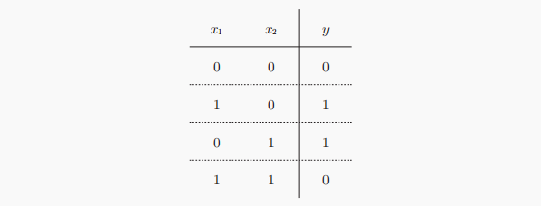
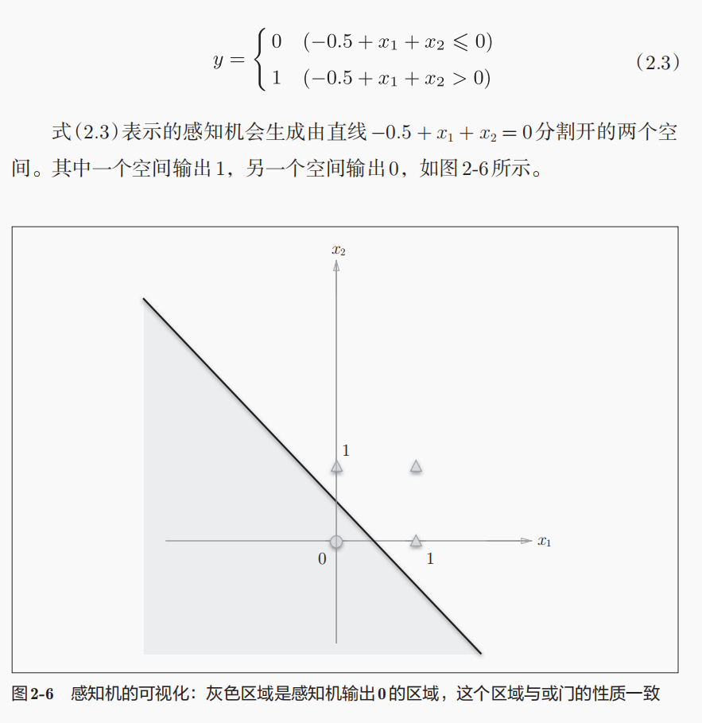
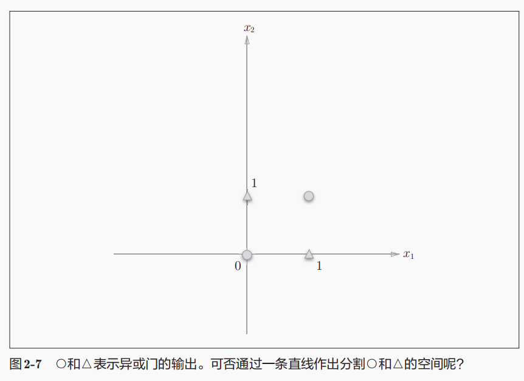
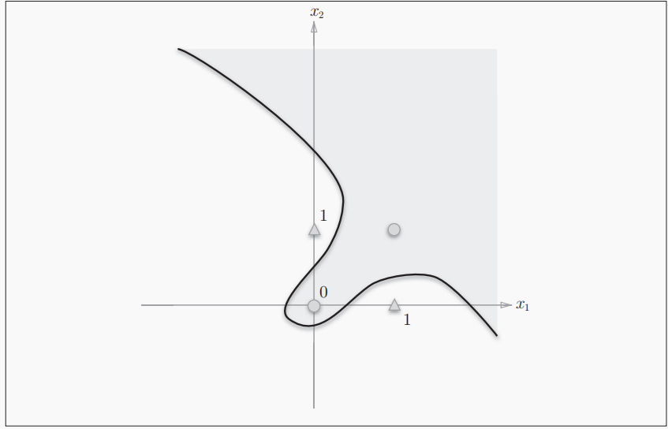

深度学习入门——基于python

## 感知机

Q：什么是感知机？感知机的功能是什么？

感知机（perceptron）是1957年提出的，是一种具有输入和输出的算法。其又或称与“人工神经元”或“朴素感知机”。

它的功能是：给定一个输出后，将输出一个既定的值。

### 简单逻辑电路

Q：与门、与非门和或门的权重表达(w1, w2, delta:阈值)。

- 与门（AND gate）：(0.5, 0.5, 0.7)

- 与非门（NAND gate）：(-0.5, -0.5, -0.6) ：与门的相反判断逻辑

- 或门（OR gate）：（0.5, 0.5, 0）


Q：机器学习的任务是什么？机器学习的“学习”是学习什么？我们人在这个过程中需要做的是什么？

机器学习的任务是：将决定感知参数的任务交给机器完成，感知的参数就比如说上面的w1和delta等。

“学习”代表的是：让机器确定好合适的参数的这个过程。

人需要做的是：1、思考与构建模型；2、给予模型（计算机）参数。

### 感知机的实现

Q：感知机将什么作为其设定参数？

感知机将**权重b**和**偏差w**设定为参数

Q：与门如何实现？

```python
def AND(x1, x2):
	# 权重和阈值设置（0.5，0.5，0.7）
	w1, w2, delta = 0.5, 0.5, 0.7
    tmp = w1*x1 + w2*x2
    if tmp > delta:
        return 1
    else:
        return 0

AND(1, 1) # 1
AND(1, 0) # 0
AND(0, 1) # 0
```

Q：利用偏置b的方式表达与门函数 

```python
import numpy as np
# -- 与门的实现
def AND(x1, x2):
    x = np.array([x1, x2])
    w = np.array([0.5, 0.5])
    b = -0.7
    tmp = sum(w*x) + b
    if tmp > 0:
        return 1
    else:
        return 0
```

Q：**权重和偏置**的在调节模型上的区别？

权重（w）的调节在于：用来控制输入参数重要程度的参数

偏置（b）的调节在于：调节整个神经元被激活的难易程度的参数

### 感知机的局限

Q：异或门是什么？能用感知机模型实现异或门吗？为什么？

**异或门**（XOR gate）：当两个输入一方为1的情况下，才会输出1。异或的意思是拒绝其他的意思。



无法使用（单层）感知机模型来实现异或门，可以用画图的形式来表达出异或门的区分域来或者用不等式来分析，在单一线性的感知机情况下，条件之间是矛盾的

Q：感知机的局限在于哪？

我们来看看单层感知机是如何来划分不同情况的，与门的感知机可视化如图。



异或门单层感知机的可视化如图。很明显我们无法通过一个直线来划分⚪和▲，这就是单层感知机的局限。



感知机的局限就在这了，它只能表示一条直线分隔的空间，但是其可以被一条曲线来分隔，我们称这样被曲线分隔的空间为**非线性空间**。



### 多层感知机

Q：如何利用已有逻辑电路来实现异或门？电路图是怎样的？

可以运用之前提到的**与门、与非门和或门**按照一定的规律链接来表示。电路图可以表示为：


Q：异或门的实现

之前实现的函数现在被利用到了，是很神奇的事情~

```python
def XOR(x1, x2):
    s1 = NAND(x1, x2)
    s2 = OR(x1, x2)
    y = AND(s1, s2)
    return y
```

Q：神经网络的引入，哪些是权重层呢？下图的感知机应该是几层感知机呢？


上面就是一个简单的多层结构的神经网络，我们可以把第0层和第1层之间的、第1层和第2层之间的视为权重层，按照权重来分的话，上图应该属于2层感知机。

### 从与非门到计算机

- 与非门的运行逻辑和计算机相同，都是输入后按照某种逻辑来进行计算来输出结果。

Q：多少层的感知机就可以构建计算机或者说可以表达任意函数？

2层的感知机就可以了，严格来说应该是**激活函数使用了非线性的sigmoid函数的感知机**。当然使用2层感知机通过设定权重来构建计算机是一件非常非常麻烦的事情

- 感知机通过叠加可以进行**进行非线性表示**
