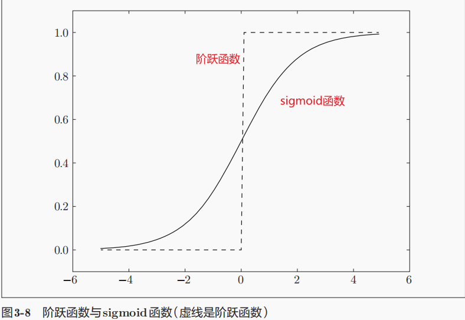

# 神经网络

Q：感知机的局限性在哪？神经网络的重要性质是什么？

感知机在选择合适的输入和权重的时候，还是需要人为的进行操作的。而神经网络是可以自动的从数据中来学习到合适的权重参数。

## 从感知机到神经网络

Q：什么是激活函数？它的作用是什么？激活的过程是如何实现的呢？

这里引入一个**新的函数h(x)**，拿之前感知机函数举例，其控制函数是$y=b+w_1x_1~+w_2x_2$的形式，现在改为$y = h(b+w_1x_1+w_2x_2)$，它将输入信号的总和转为输出信号，**这个h(x)就是激活函数**(activation function)。

而**它的作用**是在于决定如何来激活信号的总合。其中在$y = h(b+w_1x_1+w_2x_2）$中的$b+w_1x_1+w_2x_2$可以合并为一个量，其为**输入加权输入信号和偏置的总和**视为节点a。


- “朴实感知机” - 单层网络；“多层感知机” - 神经网络

## 激活函数

### 阶跃函数的实现

Q：什么是“阶跃函数”，如何实现？能想象出它的函数图是怎么样的吗？

函数公式为$\begin{align*}
h(x) = 
\begin{cases}
1 & (x > 0) \\
0 & (x \leq 0)
\end{cases}
\end{align*}$

阶跃函数的实现如下：

```python
import numpy as np
import matplotlib.pyplot as plt

# - 简单呈现形式 但其无法输入np的数组形式
def step_function_origin(x):
    if x > 0:
        return 1
    else:
        return 0
    
# - 可对np数组函数进行处理
def step_function(x):
    y = x > 0
    return y.astype(np.int32) # 元素类型转化
# 解释
x = np.array([-1.0, 1.0, 2.0])
y = x > 0 # array([False,  True,  True], dtype=bool)
y.astype(np.int32) # array([0, 1, 1])

# - 阶级函数图的实现
x = np.arange(-5.0, 5.0, 0.1) # 均匀步长矩阵
y = step_function(x)
plt.plot(x, y)
plt.ylim(-0.1, 1.1)
plt.show()
```

### sigmoid函数

$$
\begin{align*}
h(x) = \frac{1}{1 + \exp(-x)}
\end{align*}
$$

sigmoid函数的范围在（0，1）

Q：sigmoid函数和阶跃函数的联系和区别？

sigmoid和阶跃函数都是**非线性函数**

他们的区别在于：“平滑性”不同，阶跃函数是折线型的，而sigmoid函数是相对平滑的，**这种平滑性对神经网络的学习具有重要意义。**



Q：利用sigmoid的神经网络和朴素感知机区别在哪？

朴实感知机神经元间流动的是0或1的二元信号，而神经网络则流动的是**实数值信号**（平滑的sigmoid）

Q：为什么神经网络一定要使用非线性函数呢？

采用非线性函数的话，多层或者说更加深层的神经元就没有意义了，无法发挥多层网络带来的优势。比如说激活函数$h(x)=cx$，3层神经网络的即$y=h(h(h(x)))$，则其运算的过程是$y(x)=c*c*c*x$和$y(x)=a*x(a=c^3)$等效。因此要发挥出叠加层的优势，则必须要用到非线性函数。

sigmoid函数的实现

```python
import numpy as np
def sigmoid(x)
	return 1 / (1 + np.exp(-x))
```


### ReLU函数

Q：什么是ReLU函数

ReLU（Rectified Linear Unit）- 修正线性单元
$$
\begin{align*}
h(x) = 
\begin{cases}
x & (x > 0) \\
0 & (x \leq 0)
\end{cases}
\end{align*}
$$
当输入不超过0时输出0，当输入超过0是时间则输出其本身，其函数可以简化为$h(x)=max(0,x)$。其实现如下：

```python
def relu(x):
    return np.maximum(0, x)
```

## 多维数组的运算

### 神经网络的内积

下面是一个简单神经网络的矩阵运算，不含偏置b和激活函数，只运用的权重


```python
import numpy as np
X = np.array([1, 2])
W = np.array([[1, 3, 5], [2, 4, 6]])
Y = np.dot(X, W) # [ 5 11 17]
```

## 3层神经网络的实现

一个3层神经网络图简图


上面的神经网络简单赋予输入值和权重可把前向传播的矩阵写为：
$$
\begin{align*}
\begin{pmatrix}
1 & 2
\end{pmatrix}_{1 \times 2} 
\begin{pmatrix}
1 & 3 & 5 \\
2 & 4 & 6
\end{pmatrix}_{3 \times 3} 
\begin{pmatrix}
1 & 4 \\
2 & 5 \\
3 & 6
\end{pmatrix}_{3 \times 3} 
\begin{pmatrix}
1 & 3 \\
2 & 4
\end{pmatrix}_{2 \times 2} =
\begin{pmatrix}
y1&y2
\end{pmatrix}
\end{align*}
$$

### 各层神经元间的传递

Q：神经元间的传递应该是这样的呢？如何用numpy的矩阵形式表示，大致的步骤有哪些？

本书的权重表示形式为：（和常规的矩阵表示方式不太相同）


我们来看一下如何用矩阵的形式来表示带有偏置b的信号传递过程，传递的过程如图所示：


a还是我们之前看到的在基于权重w和偏差b的总和，因此整个到第一层的矩阵运算过程是：
$$
\begin{align*}
A^{(1)} = XW^{(1)} + B^{(1)}
\end{align*}
$$
其中，参数的具体形式为：

$$
\mathbf{A}^{(1)} = \begin{pmatrix} a_1^{(1)} & a_2^{(1)} & a_3^{(1)} \end{pmatrix}, \quad
\mathbf{X} = \begin{pmatrix} x_1 & x_2 \end{pmatrix}, \quad
\mathbf{B}^{(1)} = \begin{pmatrix} b_1^{(1)} & b_2^{(1)} & b_3^{(1)} \end{pmatrix}
$$

$$
\mathbf{W}^{(1)} =
\begin{pmatrix}
w_{11}^{(1)} & w_{21}^{(1)} & w_{31}^{(1)} \\
w_{12}^{(1)} & w_{22}^{(1)} & w_{32}^{(1)}
\end{pmatrix}
$$
> 可以注意到$W^{(1)}$里面的矩阵格式和常规的矩阵的下标不一样，我认为还是以列来看这个矩阵.$w_{11}$的下标第一个$1$是下一层的第1个节点,第2个$1$则是说明的是上一层的第1个节点.OK,我们来看看$W^{(1)}$矩阵,第1列展现的是前向节点对后向第1个节点带来的贡献,那么我们从第1行来看呢,就可以看到的是前向的第1个节点对后向节点的贡献,可以想象到从前向的第1个节点向后向的几个节点伸出3个小手来帮助他们吗？

至此,我们来实现下这个矩阵吧:
```python
import numpy as np
X = np.array([1.0, 0.5])
W1 = np.array([[0.1, 0.3, 0.5],
              [0.2, 0.4, 0.6]])
B1 = np.array([0.1, 0.2, 0.3])

A = np.dot(X, W1) + B1
print(A) # [0.3 0.7 1.1]
```

 当然我们还需要用激活函数sigmoid来处理一下$A^{(1)}$，就成为了第1层的最终输出结果$Z^{(1)}$，也是第2层的前向输入层

```python
Z1 = sigmoid(A) # array([0.57444252, 0.66818777, 0.75026011])
```

Q：最后一层（输出层）的激活函数是否和前面的也相同呢？ 

当然是不同的，输出层会根据其模型需要的功能的不同，而制定出不同的激活函数，而且为了和前面的激活函数$h(x)$做出区分，输出层的激活函数被称为$\sigma(x)$。

Q：输出层的函数如果根据解决问题的不同，可以分为几种？

- 分类问题
    - 二元分类问题：sigmoid函数
    - 多分类问题：softmax函数

- 回归问题：恒等函数

好的，那我们就此来实现一下这3层的神经网络吧：

1. `init_network()`: 对模型在传播过程中的偏置和权重进行初始化，并将其值记录在字典network中
2. `forward()`: 封装了从输入信号到输出信号的过程

```python
def init_network():
    ''' 网络结构为 1*2 -> 1*3 -> 1*2 -> 1*2 '''
    network = {}
    network['W1'] = np.array([[0.1, 0.3, 0.5],
                              [0.2, 0.4, 0.6]])
    network['b1'] = np.array([0.1, 0.2, 0.3])
    network['W2'] = np.array([[0.1, 0.4],
                              [0.2, 0.5],
                              [0.3, 0.6]])
    network['b2'] = np.array([0.1, 0.2])
    network['W3'] = np.array([[0.1, 0.3],
                              [0.2, 0.4]])
    network['b3'] = np.array([0.1, 0.2])

    return network

def forward(network, x):
    W1, W2, W3 = network['W1'], network['W2'], network['W3']
    b1, b2, b3 = network['b1'], network['b2'], network['b3']

    # A = XW + B
    a1 = np.dot(x, W1) + b1
    z1 = sigmoid(a1)
    a2 = np.dot(z1, W1) + b2
    z2 = sigmoid(a2)
    a3 = np.dot(z2, W1) + b3
    y = a3

    return y
```

## 输出层的设计

主要讲了恒等函数和softmax函数，将来如何实现softmax函数，还有它的一些改良措施（因为会出现溢值的情况），改量的最后结果为下，也讲了softmax函数的一些性质和理解，在分类的情况目标结果一般只输出最大的值，而softmax函数不会改变值的大小顺序，所有在实际的情况下不会用，且实际运算的$exp{(a_i)}$还需要计算时间实际就更不会用了。【笔记丢失了，不想完全补了，就简单写点吧】

softmax函数实现代码如下

```python
import numpy as np

def softmax(x):
    max_x = np.max(x)
    exp_new_x = np.exp(x - max_x)
    sum_exp_x = np.sum(exp_new_x)
    y = exp_new_x / sum_exp_x
    
	return y
```

