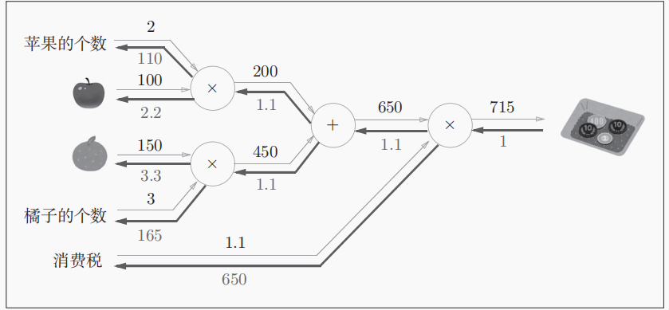
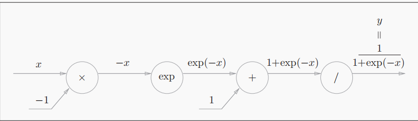
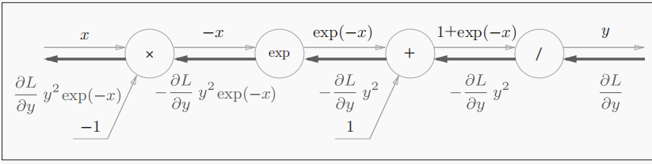
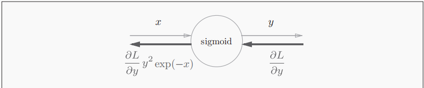

# 误差反向传播法

在很多机器学习的书籍里，将误差反向传播的时候都会一开始就展现出许多复杂的数学式，但是这样会忽略掉一些根本的东西，增加理解的难度，所有本书就引入计算图来表示反向传播的过程

## 计算图

下面是一个简单的计算图，其中横线上的是计算的中间结果，⚪里面的是节点，可以认为它是一个计算过程，也可以把他当做是一个函数 $f$，整个流程可以想象称一个电路图，中间的过程是不同大小的电流通过电路的节点


计算图的整个过程，可以抽象成很多小过程，也可以说是“局部”，通过计算图可以通过传递其中的“局部过程”来获得最终的结果，我们只需要关心，下面那个“复杂的计算”所输出的结果就好，然后在进行后续的运算，不用考虑它前面的过程，也就是你不全局的去考虑这个计算的过程，各个步骤都是分而治之，当然这也可以看出计算图的另一个优点，我们可以将这些复杂的计算结果保存起来，我们日后使用就行


接下来我们看看反向传播的过程，如下图所示，在每个输出计算结果下面都有一个反向的数值，这就代表了其传递的“局部导数”


## 链式法则

链式法则很基础就不多解释了，就给个公式
$$
\frac{\partial z}{\partial x} = \frac{\partial z}{\partial t} \cdot \frac{\partial t}{\partial x}
$$
我们来解释一下，反向传播中“局部导数”的计算方法，就以一个复合函数$ z=(x+y)^2$为例


从右往左看，反向传播的计算过程是：$节点的输入信号 * 节点的局部导数（偏导）$，

## 反向传播

下面来简单讲解两个计算节点⚪ 的，反向传播过程

### 加法的反向传播过程


输入的值经过加法的反向传播节点后，会原封不动的传递到下一个节点不会发生变化

### 乘法的反向传播过程

下面是个很简单的例子，因为$\frac{\partial z}{\partial x} = y$,$\frac{\partial z}{\partial y} = x$, 乘法的反向传播会将上游传入的输出信号再乘以前向输入信号的“反转值”再传递给下游。这点是很重要的，**乘法的反向传播需要正向的输入信号。因此实现乘法节点的反向传播过程，需要存储正向传播的输入信号**。其实我们在前向传播的过程中就可以把前节点传递到后节点的偏导计算出来，然后存储起来这样是否更加便捷


## 简单层的实现

这节就是铺垫，来完成前面的加法和乘法的节点层构建，然后赋予其实例演示来看看只有这两个层的简单网络是如何进行的

### 乘法层的是实现

定义一次乘法层的类，主要要体现出乘法层在反向传播过程中值的“反转”过程

```python
class MulLayer():
    def __init__(self):
        self.x = None
        self.y = None

    def forward(self, x, y):
        self.x = x
        self.y = y
        out = x * y

        return x * y

    def backward(self, dout):
        dx = dout * self.y
        dy = dout * self.x

        return dx, dy
```

 因为在后向传播的过程中，需要用到前向的数值，我们在初始化类的时候定义了`self.x and self.y`（初始化实例变量）以便后续使用，注意`forward`里面的输入顺序，确保要对应好后向传播的梯度，顺序的颠倒会导致“反转的失效”

### 加法层的实现

加法层的实现比较简单，且后向也不需要前向的值，所有也没有初始化实例变量

```python
class AddLayer():
    def __init__(self):
        pass

    def forward(self, x, y):
        out = x * y

        return out

    def backward(self, dout):
        dx = dout * 1
        dy = dout * 1

        return dx, dy
```

### 实例

前面构建的两个算法层，我们来进行一个小的实例演示吧，来实现下图的过程



基本步骤如下：

1. 添加输入数据
2. 添加计算层，初始化计算层（让每个计算节点赋予一个实例）
3. 前向传播的过程
4. 后向传播的过程

```python
import sys, os
from DP_by_python_rm.code.common.layers import MulLayer, AddLayer
sys.path.append(os.pardir)


# 输入层 苹果个数、橘子个数、苹果和橘子的价格、消费税
apple_cost = 100
orange_cost = 150
apple_num = 2
orange_num = 3
tax = 1.1

# 各层的初始化构建
mul_apple_layer = MulLayer()
mul_orange_layer = MulLayer()
add_layer = AddLayer()
mul_tax_layer = MulLayer()

# forward
apple_price = mul_apple_layer.forward(apple_cost, apple_num) # (1)
orange_price = mul_orange_layer.forward(orange_cost, orange_num) # (2)
all_price = add_layer.forward(apple_price, orange_price) # (3)
price = mul_tax_layer.forward(all_price, tax) #

# backward
dprice = 1
dall_price, dtax = mul_tax_layer.backward(dprice)
dapple_price, dorange_price = add_layer.backward(dall_price)


dapple_cost, dapple_number = mul_apple_layer.backward(dapple_price)
dorange_cost, dorange_number = mul_orange_layer.backward(dorange_price)


print(price)
print(dtax, dapple_cost, dorange_cost, dorange_number, dapple_number)
```

## 激活函数层的实现

### ReLU层

$$
y = 
\begin{cases} 
x & \text{} (x > 0) \\
0 & \text{} (x \leq 0)
\end{cases}
$$

$$
\frac{\partial y}{\partial x} =
\begin{cases}
1 & \left( x > 0 \right) \\
0 & \left( x \leq 0 \right)
\end{cases}
$$

ReLU层的默认接受的是数组。我们定义的难点就在于如何筛选出这些不大于0的值，前向和后向都变为0，后向大于0的数值变为1，我们添加一个mask一个掩膜，想象一下可以直接提取这些不大于0的数值的下标，然后通过这些下标来完成前后向过程需要的步骤，前向和后向就直接替换为0，确实巧妙

```python
class ReLU():
    def __init__(self):
        self.mask = None # 前后向都需要的掩膜

    def forward(self, x):
        out = x.copy()
        self.mask = (x <= 0)
        out[self.mask] = 0

        return 0

    def backward(self, dout):
        dout[self.mask] = 0
        dx = dout

        return 0 
```

我们来演示一下这个`mask`的工作原理吧，这个方式我们可以用在条件筛选上

```python
x = np.array( [[1.0, -0.5], [-2.0, 3.0]] )
mask = (x <= 0)
# [[False True]
# [ True False]]
```

### Sigmoid层

$$
y = \frac{1}{1 + \exp(-x)}
$$

sigmoid的反向过程可以看为一下的过程





当然这些中间的过程都是可以忽略的，这就是计算图的妙处，我们其实只关注输入和输出的过程，中间的步骤我们不需要过多了解，最终的过程可以简化为



反向传播的输出为$\frac{\partial L}{\partial y} y^2 \exp(-x)$,我们可以通过原函数的化简，把反向传播的最终输出改为$\frac{\partial L}{\partial y} y (1-y)  $，其最终是需要存储前向过程的输出值，我们讲起作为实例变量out来表示

```python
class Sigmoid():
    def __init__(self):
        self.out = None

    def forward(self, x):
        out = 1 / (1 + np.exp(-x))

        return out

    def backward(self, dout):
        dx = dout * (1 - self.out) * self.out

        return dx
```


