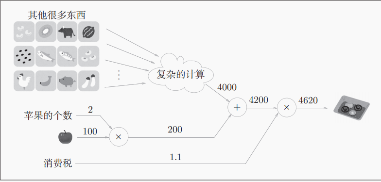
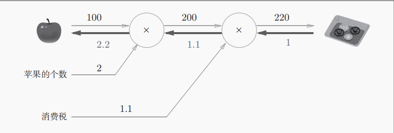
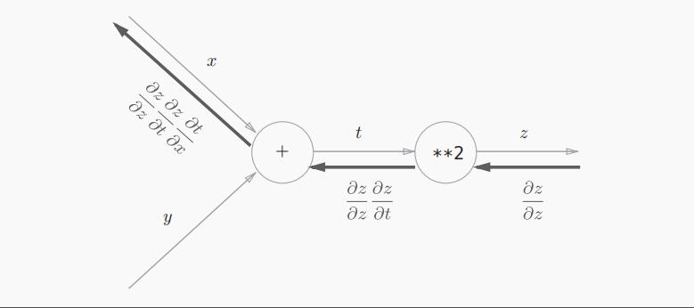
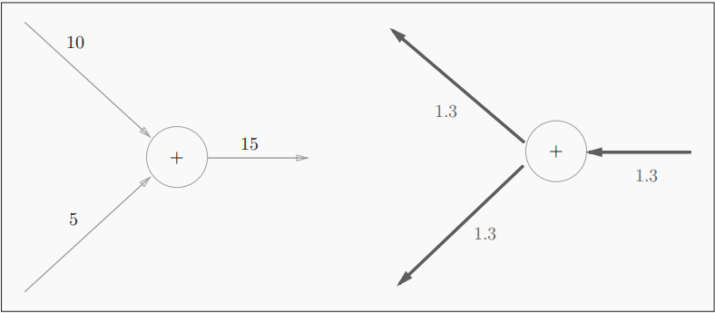
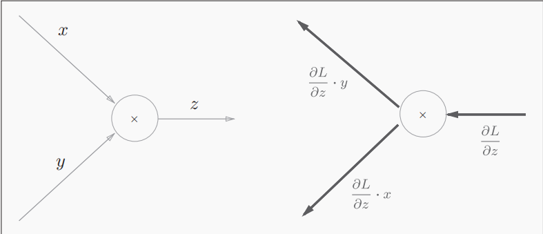

# 误差反向传播法

在很多机器学习的书籍里，将误差反向传播的时候都会一开始就展现出许多复杂的数学式，但是这样会忽略掉一些根本的东西，增加理解的难度，所有本书就引入计算图来表示反向传播的过程

## 计算图

下面是一个简单的计算图，其中横线上的是计算的中间结果，⚪里面的是节点，可以认为它是一个计算过程，也可以把他当做是一个函数 $f$，整个流程可以想象称一个电路图，中间的过程是不同大小的电流通过电路的节点

计算图的整个过程，可以抽象成很多小过程，也可以说是“局部”，通过计算图可以通过传递其中的“局部过程”来获得最终的结果，我们只需要关心，下面那个“复杂的计算”所输出的结果就好，然后在进行后续的运算，不用考虑它前面的过程，也就是你不全局的去考虑这个计算的过程，各个步骤都是分而治之，当然这也可以看出计算图的另一个优点，我们可以将这些复杂的计算结果保存起来，我们日后使用就行

接下来我们看看反向传播的过程，如下图所示，在每个输出计算结果下面都有一个反向的数值，这就代表了其传递的“局部导数”

## 链式法则

链式法则很基础就不多解释了，就给个公式
$$
\frac{\partial z}{\partial x} = \frac{\partial z}{\partial t} \cdot \frac{\partial t}{\partial x}
$$
我们来解释一下，反向传播中“局部导数”的计算方法，就以一个复合函数$ z=(x+y)^2$为例

从右往左看，反向传播的计算过程是：$节点的输入信号 * 节点的局部导数（偏导）$，

## 反向传播

下面来简单讲解两个计算节点⚪ 的，反向传播过程

### 加法的反向传播过程

输入的值经过加法的反向传播节点后，会原封不动的传递到下一个节点不会发生变化

### 乘法的反向传播过程

下面是个很简单的例子，因为$\frac{\partial z}{\partial x} = y$,$\frac{\partial z}{\partial y} = x$, 乘法的反向传播会将上游传入的输出信号再乘以前向输入信号的“反转值”再传递给下游。这点是很重要的，**乘法的反向传播需要正向的输入信号。因此实现乘法节点的反向传播过程，需要存储正向传播的输入信号**。其实我们在前向传播的过程中就可以把前节点传递到后节点的偏导计算出来，然后存储起来这样是否更加便捷

## 简单层的实现

