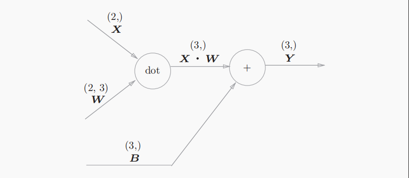

# 误差反向传播法

在很多机器学习的书籍里，将误差反向传播的时候都会一开始就展现出许多复杂的数学式，但是这样会忽略掉一些根本的东西，增加理解的难度，所有本书就引入计算图来表示反向传播的过程

## 计算图

下面是一个简单的计算图，其中横线上的是计算的中间结果，⚪ 里面的是节点，可以认为它是一个计算过程，也可以把他当做是一个函数 $f$，整个流程可以想象称一个电路图，中间的过程是不同大小的电流通过电路的节点


计算图的整个过程，可以抽象成很多小过程，也可以说是“局部”，通过计算图可以通过传递其中的“局部过程”来获得最终的结果，我们只需要关心，下面那个“复杂的计算”所输出的结果就好，然后在进行后续的运算，不用考虑它前面的过程，也就是你不全局的去考虑这个计算的过程，各个步骤都是分而治之，当然这也可以看出计算图的另一个优点，我们可以将这些复杂的计算结果保存起来，我们日后使用就行


接下来我们看看反向传播的过程，如下图所示，在每个输出计算结果下面都有一个反向的数值，这就代表了其传递的“局部导数”


## 链式法则

链式法则很基础就不多解释了，就给个公式
$$
\frac{\partial z}{\partial x} = \frac{\partial z}{\partial t} \cdot \frac{\partial t}{\partial x}
$$
我们来解释一下，反向传播中“局部导数”的计算方法，就以一个复合函数 $ z=(x+y)^2$ 为例


从右往左看，反向传播的计算过程是：$节点的输入信号 * 节点的局部导数（偏导）$，

## 反向传播

下面来简单讲解两个计算节点 ⚪ 的，反向传播过程

### 加法的反向传播过程


输入的值经过加法的反向传播节点后，会原封不动的传递到下一个节点不会发生变化

### 乘法的反向传播过程

下面是个很简单的例子，因为 $\frac{\partial z}{\partial x} = y$, $\frac{\partial z}{\partial y} = x$, 乘法的反向传播会将上游传入的输出信号再乘以前向输入信号的“反转值”再传递给下游。这点是很重要的，**乘法的反向传播需要正向的输入信号。因此实现乘法节点的反向传播过程，需要存储正向传播的输入信号**。其实我们在前向传播的过程中就可以把前节点传递到后节点的偏导计算出来，然后存储起来这样是否更加便捷


## 简单层的实现

这节就是铺垫，来完成前面的加法和乘法的节点层构建，然后赋予其实例演示来看看只有这两个层的简单网络是如何进行的

### 乘法层的是实现

定义一次乘法层的类，主要要体现出乘法层在反向传播过程中值的“反转”过程

```python
class MulLayer():
    def __init__(self):
        self.x = None
        self.y = None

    def forward(self, x, y):
        self.x = x
        self.y = y
        out = x * y

        return x * y

    def backward(self, dout):
        dx = dout * self.y
        dy = dout * self.x

        return dx, dy
```

 因为在后向传播的过程中，需要用到前向的数值，我们在初始化类的时候定义了 `self.x and self.y`（初始化实例变量）以便后续使用，注意 `forward` 里面的输入顺序，确保要对应好后向传播的梯度，顺序的颠倒会导致“反转的失效”

### 加法层的实现

加法层的实现比较简单，且后向也不需要前向的值，所有也没有初始化实例变量

```python
class AddLayer():
    def __init__(self):
        pass

    def forward(self, x, y):
        out = x * y

        return out

    def backward(self, dout):
        dx = dout * 1
        dy = dout * 1

        return dx, dy
```

### 实例

前面构建的两个算法层，我们来进行一个小的实例演示吧，来实现下图的过程


基本步骤如下：

1. 添加输入数据
2. 添加计算层，初始化计算层（让每个计算节点赋予一个实例）
3. 前向传播的过程
4. 后向传播的过程

```python
import sys, os
from DP_by_python_rm.code.common.layers import MulLayer, AddLayer
sys.path.append(os.pardir)


# 输入层 苹果个数、橘子个数、苹果和橘子的价格、消费税
apple_cost = 100
orange_cost = 150
apple_num = 2
orange_num = 3
tax = 1.1

# 各层的初始化构建
mul_apple_layer = MulLayer()
mul_orange_layer = MulLayer()
add_layer = AddLayer()
mul_tax_layer = MulLayer()

# forward
apple_price = mul_apple_layer.forward(apple_cost, apple_num) # (1)
orange_price = mul_orange_layer.forward(orange_cost, orange_num) # (2)
all_price = add_layer.forward(apple_price, orange_price) # (3)
price = mul_tax_layer.forward(all_price, tax) #

# backward
dprice = 1
dall_price, dtax = mul_tax_layer.backward(dprice)
dapple_price, dorange_price = add_layer.backward(dall_price)


dapple_cost, dapple_number = mul_apple_layer.backward(dapple_price)
dorange_cost, dorange_number = mul_orange_layer.backward(dorange_price)


print(price)
print(dtax, dapple_cost, dorange_cost, dorange_number, dapple_number)
```

## 激活函数层的实现

### ReLU 层

$$
y = 
\begin{cases} 
x & \text{} (x > 0) \\
0 & \text{} (x \leq 0)
\end{cases}
$$

$$
\frac{\partial y}{\partial x} =
\begin{cases}
1 & \left( x > 0 \right) \\
0 & \left( x \leq 0 \right)
\end{cases}
$$

ReLU 层的默认接受的是数组。我们定义的难点就在于如何筛选出这些不大于 0 的值，前向和后向都变为 0，后向大于 0 的数值变为 1，我们添加一个 mask 一个掩膜，想象一下可以直接提取这些不大于 0 的数值的下标，然后通过这些下标来完成前后向过程需要的步骤，前向和后向就直接替换为 0，确实巧妙

```python
class ReLU():
    def __init__(self):
        self.mask = None # 前后向都需要的掩膜

    def forward(self, x):
        out = x.copy()
        self.mask = (x <= 0)
        out[self.mask] = 0

        return 0

    def backward(self, dout):
        dout[self.mask] = 0
        dx = dout

        return 0 
```

我们来演示一下这个 `mask` 的工作原理吧，这个方式我们可以用在条件筛选上

```python
x = np.array( [[1.0, -0.5], [-2.0, 3.0]] )
mask = (x <= 0)
# [[False True]
# [ True False]]
```

### Sigmoid 层

$$
y = \frac{1}{1 + \exp(-x)}
$$

sigmoid 的反向过程可以看为一下的过程


当然这些中间的过程都是可以忽略的，这就是计算图的妙处，我们其实只关注输入和输出的过程，中间的步骤我们不需要过多了解，最终的过程可以简化为


反向传播的输出为 $\frac{\partial L}{\partial y} y^2 \exp(-x)$, 我们可以通过原函数的化简，把反向传播的最终输出改为 $\frac{\partial L}{\partial y} y (1-y)  $，其最终是需要存储前向过程的输出值，我们讲起作为实例变量 out 来表示

```python
class Sigmoid():
    def __init__(self):
        self.out = None

    def forward(self, x):
        out = 1 / (1 + np.exp(-x))

        return out

    def backward(self, dout):
        dx = dout * (1 - self.out) * self.out

        return dx
```

## Affine/softmax 层的实现

### Affine 层

Affine 层实现的是神经网络正向传播中的矩阵乘积的运算，其功能在几何领域也被称为“仿射变化”，其包含一次线性变化和一次平移，分别对应我们神经网络的加权和添加偏置。因为后面网络中更多的是矩阵的计算所有 Affine 层将会更加实用。



上面是前向传播的过程，相对比较简单，现在我们要考虑到其反向传播的过程，下面给出矩阵求偏导的计算式和其反向传播的过程
$$
\frac{\partial L}{\partial X} = \frac{\partial L}{\partial Y} \cdot W^T
$$

$$
\frac{\partial L}{\partial W} = X^T \cdot \frac{\partial L}{\partial Y}
$$


### 批版本的 Affine 层

和前面的批处理类似，mini-batch 的方式可以加快程序的运行速率，且在进行反向传播的时候也能保证其运行的精确性。在正向传播的过程中，偏置会被加到每个数据上去，所有在最后反向的过程中需要考虑的是偏置的和，讲偏置沿第一个轴的方向相加在一起求和（可以看为将每行的量全部加到第一行上去）


我们看看如何计算偏置第一个轴方向上的和(用上`np.sum`)

```python
dY = np.array([[1, 2, 3],
               [4, 5, 6]])
dB = np.sum(dY, axis=0)
print(dB) # [5 7 9]
```

了解了前向和反向的过程我们就来看看如何来构建Affine这个层

```python
class Affine:
    def __init__(self, W, b):
        self.W = W
        self.b = b
        self.x = None
        self.dW = None
        self.db = None

    def forward(self, x):
        self.x = x
        out = np.dot(x, self.W) + self.b

        return out

    def backward(self, dout):
        dx = np.dot(dout, self.W.T)
        self.dW = np.dot(self.x.T, dout)
        self.db = np.sum(dout, axis=0)
```

Q：可以看到将梯度`dW and db`以实例参数进行了存储，而常规的激活函数如`ReLU` 层就没有这样的操作，这是为什么呢？、

因为对于`Affine`层来说其中包含需要参与学习的权重和偏置，需要对其存储而为后续的梯度下降过程所用，而对于如`ReLU`这样的激活函数层，其并没有学习的参数，只是对输入的数据做了一次数学的操作，而激活函数的反向传播过程是计算输入的梯度，并没有设计对权重或者偏置的更新。其作用是对上层传递过来的`dout`进行变化，计算出当前层输入的梯度，再将这个梯度传递给下一层，用于更新上（前）一层的权重和偏置。

### Softmax-with-Loss层

神经网络在运行是由两个阶段**推理**和**学习**，其中在推理阶段是用不到softmax函数的，其只需要得到输出值最大的那个值就好，不需要经过softmax函数进行正则化。

下面是softmax-with-loss层的传播过程（softmax函数层和交叉误差熵函数层）


可以看到从这个层反向输出的结果是很简洁而漂亮的，就是$y-t$的， $y$的softmax前向输出的结果，$t$是对于的标签的值，下面是这个层的简单表现


这个漂亮的$y-t$就是softmax层的输出和监督标签的差分，反向传播会将这个差分表示的误差传递给前面的层，这是神经网络学习中的重要的性质 。我们神经网络的学习目的是什么？就是通过调整权重和偏置是我们的softmax输出的值和监督标签更加接近，而这两个层的叠加，高效且明了的在反向传播过程中向前向节点传递了两者的误差，实为精妙

当然这不是巧合，softmax和交叉误差熵的结合是特意设计的。在前面回归分析中，输出层为恒等函数，损失函数为平方误差和也是这个原因，这就是巧妙的算法设计

```python
class SoftmaxWithLoss:
    def __init__(self):
        self.loss = None
        self.y = None
        self.t = None

    def forward(self, x, t):
        self.t = t
        self.x = softmax(x)
        self.loss =cross_entropy_error_onehot(self.y, self.t)

    def backward(self, dout=1):
        batch_size = self.t.shape[0]
        dx = (self.y - self.t ) / batch_size

        return dx
```

可以看到对于反向传播过程中，我们可以看到传播的值需要除去`batch_size`就是批次的大小，其传递到前面就是单个数据的误差了，从前面的计算图也可以看出最后的交叉误差熵$loss function$的输出结果是整个batch样本计算后的整体结果，每个样本对损失函数都有影响，则可以得出每个样本对后面反向传播的梯度也都有影响。在这里计算的是批次内的总梯度，是为了防止只针对单一样品梯度而造成了样本的过拟合和训练过程中不稳定。

### 误差反向传播的实现

#### 神经网络类的构建

在本次构建中，引入了**层**的概念，在我们的预测方法和梯度计算方法中只用有序的调用层就行，就可以通过层间的传递来完成任务，下面看看我们对之前`TwoLayerNet()`类的改进

```python
import sys, os
sys.path.append(os.pardir)
import numpy as np
from DP_by_python_rm.code.common.functions import *
from DP_by_python_rm.code.common.layers import *
from collections import OrderedDict # 有序字典的包

class TwoLayerNet:
    def __init__(self, input_size, hidden_size, output_size,
                 weight_init_std=0.1):
        # 初始化参数
        self.params = {}
        self.params['W1'] = weight_init_std * \
            np.random.randn(input_size, hidden_size)
        self.params['b1'] = np.zeros(hidden_size)
        self.params['W2'] = weight_init_std * \
            np.random.randn(hidden_size, output_size)
        self.params['b2'] = np.zeros(output_size)

        # 生成层实例 -- 如果后面有更多的层只需要在这里添加就行(new)
        self.layers = OrderedDict()
        self.layers['Affine1'] = \
            Affine(self.params['W1'], self.params['b1'])
        self.layers['Relu1'] = ReLU()
        self.layers['Affine2'] = \
            Affine(self.params['W2'], self.params['b2'])

        self.lastLayer = SoftmaxWithLoss()

    def predict(self, x):
        for layer in self.layers.values():
            x = layer.forward(x)

        return x

    def loss(self, x, t):
        y = self.predict(x)
        return self.lastLayer.forward(y, t)

    def accuracy(self, x, t):
        y = self.predict(x)
        y = np.argmax(y, axis=1)
        if t.ndim != 1 :
            t = np.argmax(t, axis=1)

        accuracy = np.sum( y == t) / float(x.shape[0])

        return accuracy

    def numercal_gradient(self, x, t):
        loss_W = lambda W : self.loss(x, t)

        grads = {}
        grads['W1'] = numerical_gradient(loss_W, self.params['W1'])
        grads['W2'] = numerical_gradient(loss_W, self.params['W2'])
        grads['b1'] = numerical_gradient(loss_W, self.params['b1'])
        grads['b2'] = numerical_gradient(loss_W, self.params['b2'])

        return grads

    # 反向误差传播法计算梯度(new)
    def gradient(self, x, t):
        # forward
        self.loss(x, t)

        # backward
        dout = 1
        dout = self.lastLayer.backward(dout)


        layers = list(self.layers.values())
        layers.reverse()

        for layer in layers:
            dout = layer.backward(dout) # 更新参数的过程

        # 设定
        grads = {}
        grads['W1'] = self.layers['Affine1'].dW
        grads['b1'] = self.layers['Affine1'].db
        grads['W2'] = self.layers['Affine2'].dW
        grads['b2'] = self.layers['Affine2'].db

        return grads
```

与之前构建不同，这次引入了新的实例`self.layers = OrderedDict()`，你可以理解为它的功能就是来实现和展现出计算图的功能，其中不乏很多的节点，然后我们前面初始化的参数经过这些就节点进行操作，且最为关键的是**其每层都以键值的形式将计算值和参数都存储到了有序字典layers实例中**，这些键和值都以输入的顺序（也就是计算图的正向运行的顺序）排列着，这样在前向预测和反向传播的过程中需要调用这个字典的值就可以得到我们存储到的值（反向传播是可以反转键，来实现计算图中反向的过程），我们需要做的任务就是按照计算图的顺序正向的在这个`layers`中输入我们需要的层，这样也大大方便了我们后面多层网络的构建，只要继续这里输入我们想要的新层就行，十分的方便！

还有就是加入了`gradient(self, x, t)`，层字典键值反向就不多解释，我们来聊聊这个`for`循环，其是反向传播的实现步骤，就在这种过程中，一层一层的上层误差被传递到了下层，各层参数对应损失函数的梯度也被一步一步求出来，就等待后面添加实例来更新参数了。

#### 误差反向传播法的梯度确认

我们可以看到梯度反向传播算法是比较复杂的，相对也容易出错，所有我们这是要拿出我们前面的数值梯度计算的方法来验正一下我们反向算法的正确性，这个过程就是梯度确认的过程和原因

```python
from dataset.mnist import load_mnist

(x_train, t_train), (x_test, t_test) = \
    load_mnist(normalize=True, one_hot_label=True)

network = TwoLayerNet(input_size=784, hidden_size=50, output_size=10)

x_batch = x_train[:3]
t_batch = t_train[:3]

grad_numerical = network.numercal_gradient(x_batch, t_batch)
grad_backprop = network.gradient(x_batch, t_batch)

for key in grad_numerical.keys():
    diff = np.average(np.abs(grad_backprop[key] - grad_numerical[key]))
    print(f"key : {str(diff)}")
```


